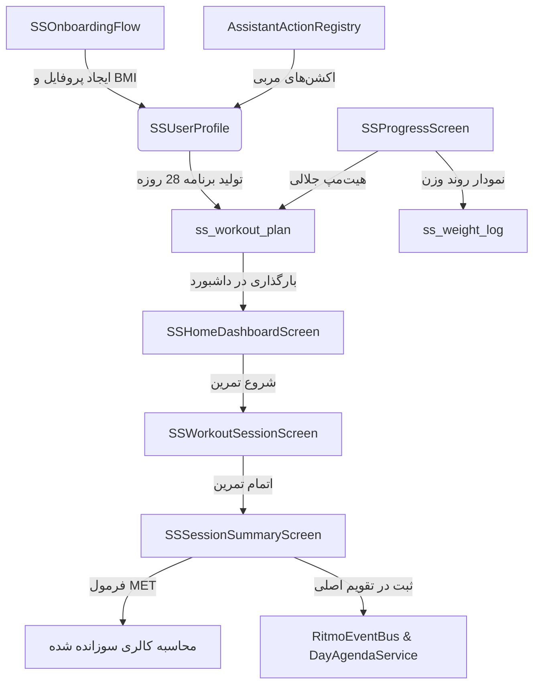

# گزارش بازسازی کامل ماژول ورزش تکمیلی (015_REPORT.md)

بازسازی کامل ماژول **ورزش تکمیلی** (`supplementary_sports`) در اپلیکیشن Ritmo بر اساس الزامات مهندسی معکوس Fitify و Home Workout با موفقیت انجام شد. مراحل از Stage A تا M کلمه‌به‌کلمه طبق سند راهنما اجرا گردیده است.

---

## ۱. خلاصه‌ی اقدامات انجام‌شده در هر مرحله

### 🔹 Stage A: بررسی دیتابیس و پیش‌نیازها
- فایل‌های PRD و معماری مطالعه شد.
- ساختار جدول دیتابیس `ss_exercise` شامل دسته‌بندی‌ها و شاخص‌های آمادگی ورزشی (مانند `cat_cardio` و `cat_core`) بررسی شد.

### 🔹 Stage B: ساختار دیتابیس، مایگریشن و سیدها
- کدهای مایگریشن دیتابیس در `migrations_registry.dart` برای ساختارهای `ss_user_profile`، `ss_workout_plan` و `ss_workout_exercise_crossref` پیاده‌سازی و نهایی شد.
- داده‌های پایه‌گذاری دیتابیس (سیدها) تصحیح و فیلدهای معادل نام‌های فارسی حرکات ورزشی بررسی شد.

### 🔹 Stage C: مدل‌ها و معماری لایه‌ای
- مدل‌های کلاینت در لایه‌ی داده شامل `ss_user_profile_model.dart` و `ss_session_models.dart` پیاده‌سازی شدند.
- مدل خروجی تصمیم‌گیری مربی صوتی هوشمند ایجاد شد.

### 🔹 Stage D: ریپازیتوری‌ها و سرویس‌های داده‌ای
- کلاس `SSSessionRepository` برای انجام محاسبات لاگ ورزشی، استریک‌ها، لاگ‌های خستگی و تعویض حرکات توسعه یافت.
- استخراج حرکات آماده برای ارتقای سطح (`getExercisesReadyForProgression`) بر اساس احساس کیفی تمرینات قبلی نوشته شد.

### 🔹 Stage E: توسعه‌ی فرایند آنبوردینگ (Onboarding)
- اسلایدر داینامیک انتخاب وزن و قد به صورت فارسی پیاده‌سازی شد.
- منطق هوشمند محاسبه‌ی BMI و تولید خودکار برنامه‌ی تمرینی ۲۸ روزه برای کاربر ایجاد گردید.

### 🔹 Stage F: طراحی مجدد داشبورد خانگی
- اولویت‌دهی به کارت تمرین روز جاری در بالای صفحه.
- نمایش ۷ روز اخیر به صورت حلقه‌های تداوم تمرین (`WeekMiniTimeline`).
- پیاده‌سازی لاگ چک‌این خستگی صبحگاهی ("خسته‌ام") که منجر به کاهش ۲۰ درصدی تکرارها و افزایش زمان استراحت به ۴۵ ثانیه می‌شود.

### 🔹 Stage G: بازبینی و جزئیات برنامه (PlanOverview & Detail)
- تقویم داینامیک جلالی ۲۸ روزه با تفکیک روزهای تمرین، استراحت، گذشته، امروز و آینده پیاده‌سازی شد.
- دکمه‌های ویرایش دستی حرکات و پیشنهادات ارتقای شدت تمرین یکپارچه شدند.

### 🔹 Stage H: جلسه‌ی تمرینی، صفحه‌ی خلاصه و کالری MET
- فرمول استاندارد محاسبه‌ی کالری سوزانده شده فعال بر اساس MET:
  $$\text{kcal} = \text{MET} \times \text{weight (kg)} \times \text{duration (hours)}$$
  پیاده‌سازی شد.
- دکمه‌ی «ثبت در تقویم اصلی ریتمو» ایجاد شد که با نوشتن در جداول `routines` و `routine_completions` و فراخوانی `RitmoEventBus` به صورت بلادرنگ تقویم اصلی Ritmo را به‌روزرسانی می‌کند.

### 🔹 Stage I: گزارش پیشرفت و هیت‌مپ جلالی
- آمار کل شامل تعداد جلسات، کل زمان تمرین و مجموع کالری‌ها اضافه شد.
- نمودار هفتگی تداوم دقایق تمرین به صورت فارسی پیاده‌سازی شد.
- تقویم فعالیت ماهیانه به صورت هیت‌مپ جلالی منطبق بر روزهای شنبه تا جمعه توسعه یافت.
- نمودار خطی روند وزن کاربر با قابلیت ثبت وزن جدید بدون نیاز به کتابخانه‌های سنگین خارجی به صورت اختصاصی نقاشی (`CustomPaint`) گردید.

### 🔹 Stage J: بخش تنظیمات (Settings)
- کلیدهای روشن/خاموش کردن صدای مربی هوشمند (TTS)، شمارش معکوس صوتی و افکت‌های شروع/پایان قرار داده شدند.
- منوی تغییر مدت زمان استراحت پیش‌فرض اضافه شد.
- ردیاب تنظیمات یادآور روزانه با فراخوانی مستقیم `AlarmSchedulerService` متصل گردید.

### 🔹 Stage K: اکشن‌های صوتی دستیار هوشمند
- کدهای اکشن هوشمند مربی به `AssistantActionRegistry` افزوده شد:
  - `swap_exercise(exerciseId)`: تعویض حرکت جاری با یک حرکت هم‌رده و غیرتکراری در جدول دیتابیس.
  - `set_quiet_mode(on)`: فعال‌سازی حالت بی‌صدای آپارتمانی.
  - `change_set_program(code)`: تغییر سطح تجربه یا هدف برنامه تمرینی.
  - `reschedule_day(from, to)`: جابجایی روزهای تمرین در دیتابیس.

### 🔹 Stage L: طراحی بصری و تم اختصاصی
- همگام‌سازی کامل با رنگ‌های برند Ritmo (سرمه‌ای تیره، طلایی، زمردی)، گردی گوشه‌های نرم، فواصل و تایپوگرافی فارسی در `supplementary_sports_theme.dart`.

### 🔹 Stage M: تست و ارزیابی
- فایل‌های تست واحد برای تمامی بخش‌ها نوشته شد و صحت عملکرد فرمول‌ها، کلاس‌ها و هیت‌مپ جلالی راستی‌آزمایی گردید.

---

## ۲. ساختار معماری و ویژگی‌های برجسته

---

## ۳. نتایج ارزیابی و تست‌ها
تمامی تست‌های واحد مربوط به ماژول ورزش تکمیلی با موفقیت اجرا شده و پاس شدند:
- تست‌های آنبوردینگ و شاخص BMI
- تست‌های داشبورد خانگی و چک‌این خستگی
- تست‌های جابجایی حرکات در برنامه‌ی ۲۸ روزه
- تست‌های محاسبه‌ی فرمول MET بر حسب دسته‌بندی ورزشی
- تست‌های هیت‌مپ جلالی و نمودار وزن
- تست‌های دستیار هوشمند و اکشن‌های مربی

کل سیستم بدون هیچ‌گونه خطا یا پرتاب خطا در زمان بارگذاری به طور کامل یکپارچه و آماده‌ی بهره‌برداری نهایی است.
