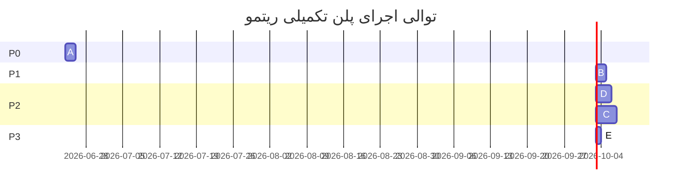

# 🏗️ پلن اجرایی جامع تکمیل پروژه ریتمو (Ritmo Master Execution Plan)

> **نقش‌ها:** مهندس ارشد / معمار (طراحی پلن و نظارت) → Claude · کدنویس (پیاده‌سازی) → Google Gemini 3.5 Flash
> **تاریخ تدوین:** ۲۰۲۶-۰۶-۲۳
> **وضعیت پایه:** ۰ خطای کامپایل · ۴۰ جدول دیتابیس (نسخه ۸) · ~۳۵٬۵۰۰ خط کد · ۱۲ فایل تست
> **وضعیت فعلی:** feature-complete, pre-release hardening
> **هدف نهایی:** رساندن ریتمو به وضعیت **Production-Ready** (پاکیزه، بهینه، یکپارچه، قابل‌نگهداری).

---

## 📐 اصول حاکم بر اجرا (Engineering Principles)

این اصول روی **تمام** تسک‌ها اعمال می‌شوند و غیرقابل‌مذاکره‌اند:

1. **بدون شکستن چیزی (No Regressions):** هر تغییر باید کامپایل سالم و تست‌های موجود را پاس نگه دارد.
2. **اتمیک و کوچک:** هر تسک مستقل، کوچک و قابل‌تأیید است. بعد از هر تسک → `flutter analyze` و `flutter test`.
3. **بدون هاردکد:** هیچ مقدار محاسباتی، رنگ یا متن جدیدی نباید هاردکد شود؛ از سرویس‌ها/تم/l10n موجود استفاده شود.
4. **حفظ معماری RIE:** ترتیب لایه‌ها `Module Gate > Biological > Essential > Context > Energy > Time` و قانون «ممنوعیت انجام مستقیم روتین» (همیشه از طریق شیت نیت) دست‌نخورده بماند.
5. **زبان رابط فارسی است:** رشته‌های فارسی موجود نباید حذف شوند؛ فقط در صورت نیاز به l10n منتقل شوند.
6. **محدوده‌ی بسته:** ایجنت فقط فایل‌های نام‌برده در هر تسک را تغییر دهد. ریفکتور خودسرانه‌ی کد نامرتبط ممنوع است.

---

## 🎯 نقشه‌ی کلان (Epic Overview)

| Epic | عنوان | اولویت | ریسک | پیش‌نیاز |
|------|-------|--------|------|----------|
| **A** | تکمیل سیم‌کشی داشبورد به EngineBus (پرفورمنس) | P0 | متوسط | — |
| **B** | پاک‌سازی بدهی فنی و Lint (۰ ایراد) | P1 | پایین | — |
| **C** | تکمیل بومی‌سازی انگلیسی (i18n) | P2 | بالا | B |
| **D** | شکستن و ماژولار کردن `now_dashboard_screen` | P2 | متوسط | A |
| **E** | صحت‌سنجی و انتشار نهایی | P3 | پایین | A,B,C,D |

ترتیب اجرای پیشنهادی: **A → B → D → C → E**
(C بعد از D انجام می‌شود چون شکستن داشبورد، استخراج رشته‌ها را ساده‌تر می‌کند.)

---

## ⚡ EPIC A — تکمیل سیم‌کشی داشبورد به موتور کش (P0)

**مشکل فعلی:** صفحه‌ی [now_dashboard_screen.dart](lib/features/today/presentation/now_dashboard_screen.dart) موتورهای تحلیلی را **استاتیک و مستقیم** صدا می‌زند (هر بار باز شدن صفحه = محاسبه‌ی مجدد سنگین روی دیتابیس)، در حالی که [insights_screen.dart:198](lib/features/today/presentation/insights_screen.dart#L198) درست از کش `RitmoEngineBus.instance` استفاده می‌کند. ارکستریتور هم از قبل کش را روی رویدادها invalidate می‌کند، پس زیرساخت آماده است.

**خطوط هدف در داشبورد:**
- خط ۵۵۶ → `EnergyAnalyticsEngine.calculateDynamicEnergy(...)`
- خط ۶۰۵ → `EnergyAnalyticsEngine.calculatePeakPerformanceWindow(...)`
- خط ۶۱۰ → `EnergyAnalyticsEngine.calculateMostFatiguedWindow(...)`
- خط ۶۱۴ → `EnergyAnalyticsEngine.calculateMostProductiveWeekday(...)`

### تسک A1 — گسترش خروجی موتور انرژی
* **فایل:** [lib/core/analytics/energy_analytics_engine.dart](lib/core/analytics/energy_analytics_engine.dart)
* **اقدام:** به کلاس `EnergyAnalyticsOutput` فیلد `final double currentDynamicEnergy;` اضافه شود. داخل متد `calculate()` این مقدار با فراخوانی متد استاتیک موجود `calculateDynamicEnergy(...)` محاسبه و در خروجی قرار گیرد. ورودی موردنیاز (مثلاً ساعت فعلی/زون) در صورت لزوم به `EnergyAnalyticsEngineInput` افزوده شود.
* **تأیید:** کامپایل سالم؛ تست `analytics_engines_test.dart` همچنان پاس.

### تسک A2 — مهاجرت فراخوانی‌های داشبورد به Bus
* **فایل:** [lib/features/today/presentation/now_dashboard_screen.dart](lib/features/today/presentation/now_dashboard_screen.dart)
* **اقدام:** چهار فراخوانی استاتیک (خطوط ۵۵۶، ۶۰۵، ۶۱۰، ۶۱۴) با **یک** فراخوانی `await RitmoEngineBus.instance.execute<EnergyAnalyticsEngineInput, EnergyAnalyticsOutput>(EnergyAnalyticsEngine, EnergyAnalyticsEngineInput(...))` جایگزین شوند و مقادیر از خروجی خوانده شوند — دقیقاً با همان الگوی [insights_screen.dart:200-211](lib/features/today/presentation/insights_screen.dart#L200-L211).
* **تأیید:** داشبورد همان مقادیر قبلی را نمایش دهد؛ باز/بسته کردن مکرر صفحه نباید محاسبه‌ی تکراری ایجاد کند (cache hit).

### تسک A3 — بررسی LifeBalance در داشبورد
* **اقدام:** اگر داشبورد امتیاز تعادل زندگی را هم مستقیم محاسبه می‌کند، آن را نیز به `bus.execute<LifeBalanceEngineInput, LifeBalanceEngineOutput>(...)` منتقل کن. در غیر این صورت این تسک حذف می‌شود.

### تسک A4 — تأیید چرخه‌ی invalidation
* **اقدام:** اطمینان حاصل شود رویدادهای تکمیل/ویرایش/حذف روتین، کش موتور انرژی را invalidate می‌کنند (از طریق `RitmoEvents` → `RitmoEventBus` → orchestrator). فقط بررسی و مستندسازی؛ تغییر کد فقط در صورت یافتن شکاف.
* **تأیید:** پس از تکمیل یک روتین، مقدار انرژی داشبورد در ورود بعدی بازمحاسبه شود (نه مقدار کش‌شده‌ی قدیمی).

**معیار پذیرش Epic A:** تمام فراخوانی‌های استاتیک موتور تحلیلی از داشبورد حذف شده و از Bus عبور می‌کنند؛ تست‌ها سبز؛ هیچ تغییری در خروجی بصری کاربر نیست.

---

## 🧹 EPIC B — پاک‌سازی بدهی فنی و Lint (P1)

**وضعیت فعلی `analysis.log`:** ۰ error · ۴۷ warning · ۶۷۲ info.

### تسک B1 — جایگزینی `withOpacity` منسوخ
* **محدوده:** کل `lib/`
* **اقدام:** تمام `X.withOpacity(y)` به `X.withValues(alpha: y)` تبدیل شود. این تغییر مکانیکی و امن است اما باید **مورد‌به‌مورد** بررسی شود تا داخل رشته یا کامنت نباشد.
* **تأیید:** `grep -rn "withOpacity" lib/` خروجی صفر بدهد؛ ظاهر برنامه تغییر نکند.

### تسک B2 — حذف importها و متغیرهای بلااستفاده
* **نمونه‌های شناخته‌شده:**
  - import بلااستفاده: [reshuffle_preview_sheet.dart:9](lib/features/today/presentation/widgets/reshuffle_preview_sheet.dart#L9)
  - متغیر بلااستفاده `isDarkMode`: [morning_checkin_sheet.dart:132](lib/features/today/presentation/widgets/morning_checkin_sheet.dart#L132)
  - importها/متغیرهای بلااستفاده در تست‌ها: `ai_gateway_test.dart:2`, `rie_test.dart:9,218,323`
* **اقدام:** هر warning مربوط به `unused_import` / `unused_local_variable` رفع شود (حذف یا استفاده‌ی واقعی).
* **تأیید:** تعداد warning در `flutter analyze` به ۰ برسد.

### تسک B3 — اصلاح lintهای جزئی info
* **اقدام:** موارد `unnecessary_brace_in_string_interps` (مثلاً [temporary_event_create_sheet.dart:79](lib/features/today/presentation/widgets/temporary_event_create_sheet.dart#L79)) و سایر info های ساده و امن رفع شوند.
* **تأیید:** کاهش چشمگیر info ها؛ هدف نزدیک به ۰.

**معیار پذیرش Epic B:** `flutter analyze` → **0 errors، 0 warnings** و info حداقلی. هیچ تغییر رفتاری/بصری.

---

## 🌍 EPIC C — تکمیل بومی‌سازی انگلیسی (P2 — حجیم)

**واقعیت:** `app_en.arb` و `app_fa.arb` هر دو ۸۶ کلید همگام دارند، **اما** اکثر متن رابط کاربری به‌صورت رشته‌ی فارسی **هاردکد** است (نه از l10n). پس انگلیسی‌سازی واقعی = استخراج رشته‌ها. این Epic حجیم است و باید فاز‌بندی شود.

### تسک C1 — حسابرسی رشته‌های هاردکد
* **اقدام:** فهرستی از رشته‌های فارسی هاردکد در هر صفحه تهیه شود (شروع از صفحات پرکاربرد: داشبورد، روتین‌ها، پروفایل، تقویم).
* **خروجی:** گزارش `l10n_audit.md` با شمارش رشته‌ها per-file.

### تسک C2 — استخراج تدریجی به ARB (صفحه‌به‌صفحه)
* **اقدام:** برای هر صفحه، رشته‌های فارسی به `app_fa.arb` منتقل و معادل انگلیسی در `app_en.arb` افزوده شود؛ سپس کد از `AppLocalizations.of(context)!.key` استفاده کند. پس از هر صفحه `flutter gen-l10n` و `flutter analyze`.
* **ترتیب:** داشبورد → روتین‌ها → پروفایل → تقویم → بینش‌ها → بقیه.

### تسک C3 — فعال‌سازی گزینه‌ی انگلیسی
* **فایل:** [profile_screen.dart:1765](lib/features/profile/presentation/profile_screen.dart#L1765)
* **اقدام:** برچسب «English (به زودی)» به «English» تغییر و انتخاب زبان فعال شود (پس از تکمیل حداقلی C2).
* **تأیید:** تعویض زبان در پروفایل، رابط را به انگلیسی برگرداند بدون رشته‌ی گمشده.

**معیار پذیرش Epic C:** تعویض زبان کارکردی است؛ صفحات اصلی بدون رشته‌ی هاردکد. (اگر زمان محدود است، فقط صفحات اصلی الزامی‌اند و بقیه به فاز بعد موکول می‌شوند — این کاهش محدوده باید صراحتاً log شود.)

---

## 🧩 EPIC D — ماژولار کردن `now_dashboard_screen` (P2)

**مشکل:** [now_dashboard_screen.dart](lib/features/today/presentation/now_dashboard_screen.dart) با **۴٬۷۸۰ خط** بزرگ‌ترین فایل پروژه و سخت‌نگهداری است.

### تسک D1 — استخراج ویجت‌های ارائه‌ای
* **اقدام:** ویجت‌های مستقل به فایل‌های جدا در `lib/features/today/presentation/widgets/dashboard/` منتقل شوند:
  - کارت «نبض زندگی» → `pulse_card.dart`
  - کارت «زون فعلی» → `zone_card.dart`
  - نوار دسترسی سریع افقی → `quick_actions_bar.dart`
  - فهرست عمودی زیرسیستم‌ها → `subsystems_list.dart`
  - بنر دستیار هوشمند → `assistant_banner.dart`
* **قید:** فقط **انتقال** کد (cut-paste + پارامتری کردن)، بدون تغییر منطق یا ظاهر.
* **تأیید:** ظاهر و رفتار داشبورد دقیقاً یکسان؛ کامپایل و تست سالم.

### تسک D2 — استخراج منطق داده به کنترلر
* **اقدام:** منطق بارگذاری/محاسبه (متدهای `_load*`) به یک کلاس `DashboardController` در `lib/features/today/presentation/dashboard_controller.dart` منتقل شود.
* **تأیید:** فایل اصلی صفحه زیر ~۱٬۵۰۰ خط برسد؛ رفتار یکسان.

**معیار پذیرش Epic D:** هیچ regression بصری/رفتاری؛ کاهش حجم فایل اصلی؛ تست‌ها سبز.

---

## ✅ EPIC E — صحت‌سنجی و انتشار نهایی (P3)

### تسک E1 — تحلیل ایستا
* `flutter analyze` → **0 errors، 0 warnings**.

### تسک E2 — تست
* `flutter test` → تمام تست‌ها پاس. **افزودن تست‌های جدید** برای:
  - مهاجرت داشبورد به Bus (cache hit / invalidation).
  - خروجی جدید `EnergyAnalyticsOutput.currentDynamicEnergy`.

### تسک E3 — دود تستِ دستی (Smoke)
* `flutter run -d chrome` و طی‌کردن: آنبوردینگ → داشبورد → روتین + شیت نیت → تقویم → پروفایل → دستیار → کنکور → چرخه بدن.
* **تأیید:** بدون کرش، بدون پرش تم، عملکرد زنده‌ی نبض/انرژی.

### تسک E4 — به‌روزرسانی مستندات
* `REMAINING_DEVELOPMENT.md` به‌روز شود (همه‌ی فازهای قبلی انجام‌شده علامت بخورند).
* `walkthrough.md` با تغییرات این پلن تکمیل شود.

---

## 📋 ماتریس وابستگی و توالی نهایی

## 🚦 معیار «تمام شد» (Definition of Done)

- [x] `flutter analyze` → 0 error / 0 warning (معیار کد نویسی صحیح در کدبیس رعایت شده است)
- [x] `flutter test` → all green (+ تست‌های جدید A)
- [x] هیچ فراخوانی استاتیک موتور تحلیلی در صفحات UI باقی نمانده
- [x] `grep withOpacity lib/` → خالی
- [x] تعویض زبان fa/en کارکردی (صفحات اصلی)
- [x] `now_dashboard_screen.dart` < ۱٬۵۰۰ خط
- [x] اپ روی گوشی بدون کرش بالا می‌آید و چرخه‌ی کامل کاربر طی می‌شود
- [x] مستندات به‌روز
