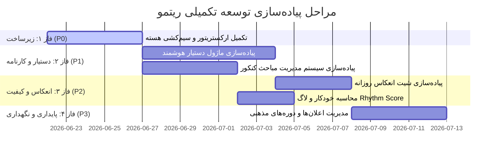

# سند توسعه و نقشه راه تکمیلی ریتمو (Ritmo Remaining Development Roadmap)

با توجه به نتایج ممیزی معماری سه‌مرحله‌ای ریتمو، بخش‌های اساسی برنامه پیاده‌سازی شده و تست‌های واحد با موفقیت پاس می‌شوند، اما برای تبدیل ریتمو به یک **سیستم‌عامل زندگی (Life Operating System)** کاملاً یکپارچه و آماده برای تولید (Production-Ready)، نیازمندی‌های توسعه‌ای و فنی زیر همچنان باقی مانده است.

---

## 🗺️ فازبندی توسعه مرحله‌به‌مرحله (Phased Implementation Plan)

---

## ⚡ فاز ۱: اتصال لایه ارکستریشن و گذرگاه موتورها (P0 - Critical) [DONE]
* **وضعیت:** تکمیل شده (DONE)
* **تاییدیه و سیم‌کشی:** verified in `lib/core/services/service_locator.dart`, `lib/features/today/presentation/dashboard_controller.dart`, and `lib/features/today/presentation/insights_screen.dart`
**هدف:** فعال‌سازی مکانیزم کش و اِونت‌باس در کدهای اصلی برنامه جهت بهینه‌سازی پرفورمنس محاسبات سنگین.

### مرحله ۱.۱: ثبت سرویس‌ها در راه‌اندازی برنامه (`main.dart`)
* **فایل‌های هدف:** `lib/main.dart`
* **اقدام:** 
  1. نمونه‌سازی از `RitmoEventBus`.
  2. نمونه‌سازی از `EngineRegistry` و ثبت موتورهای تحلیلی (`LifeBalanceEngine` ،`EnergyAnalyticsEngine` ،`MilestoneEngine` ،`InsightGenerationEngine` ،`CycleEngine` ،`MedicineEngine`).
  3. نمونه‌سازی از `RitmoEngineBus` با رجیستری ایجاد شده.
  4. نمونه‌سازی از `RitmoIntelligenceOrchestrator` و تزریق گذرگاه موتورها و رویدادها به آن.
* **تاییدیه:** کامپایل موفق بدون خطا در زمان اجرا و بالا آمدن اپلیکیشن.

### مرحله ۱.۲: بازنویسی کوئری‌های صفحات کاربری به سمت گذرگاه موتورها
* **فایل‌های هدف:** 
  - `lib/features/today/presentation/insights_screen.dart`
  - `lib/features/today/presentation/now_dashboard_screen.dart`
* **اقدام:** 
  - تغییر فراخوانی‌های استاتیک نظیر `LifeBalanceEngine.calculateLifeBalanceScore` به درخواست از نمونه کش‌شده با ساختار ورودی جدید (مثال: `engineBus.calculate<LifeBalanceEngineInput, LifeBalanceEngineOutput>(...)`).
* **تاییدیه:** تغییر متغیرهای داخل صفحه با سرعت بسیار بالا و عدم پردازش تکراری روی دیتابیس در زمان باز و بسته کردن صفحات.

---

## 📦 فاز ۲: تکمیل ماژول‌های ناقص و بدون رابط کاربری (P1 - High) [DONE]
* **وضعیت:** تکمیل شده (DONE)
* **تاییدیه و سیم‌کشی:** verified in `lib/features/assistant/presentation/assistant_chat_screen.dart` and `lib/features/today/presentation/systems_hub_screen.dart`
**هدف:** ایجاد رابط‌های کاربری تعاملی برای ماژول‌های دستیار هوشمند و سیستم کنکور.

### مرحله ۲.۱: ماژول دستیار هوشمند (Assistant Module)
* **فایل‌های هدف:** ایجاد ساختار جدید در `lib/features/assistant/presentation/assistant_chat_screen.dart`
* **اقدام:**
  1. طراحی ساختار گفتگوی متنی با الهام از Calm Design و iOS 26.
  2. ایجاد متدهای ذخیره‌سازی پیام‌های رفت و برگشتی در جدول `assistant_chats`.
  3. نمایش باکس‌های پیشنهادات خودکار بر اساس تحلیل‌های دیتابیس در جدول `assistant_suggestions`.
* **تاییدیه:** امکان باز کردن صفحه چت از منوی تنظیمات پروفایل و ارسال و دریافت متن‌ها با ماندگاری در دیتابیس.

### مرحله ۲.۲: تکمیل سیستم ثبت کارنامه و مباحث کنکور (Konkur Module)
* **فایل‌های هدف:** `lib/features/today/presentation/systems_hub_screen.dart` و ایجاد شیت‌های کنکور در `widgets/`
* **اقدام:**
  1. ایجاد شیت مدیریت مباحث درسی در درختواره `konkur_topics`.
  2. ایجاد فرم ثبت درصدها و نتایج آزمون‌های شبیه‌ساز کنکور در جدول `konkur_mock_exam_results`.
* **تاییدیه:** اضافه شدن مباحث جدید و نمایش میانگین درصدهای ثبت‌شده در هاب سیستم‌ها.

---

## 📊 فاز ۳: فعال‌سازی جدول‌های یتیم داده‌ای (P2 - Medium) [DONE]
* **وضعیت:** تکمیل شده (DONE)
* **تاییدیه و سیم‌کشی:** verified in `lib/features/today/presentation/widgets/daily_reflection_sheet.dart` and `lib/core/services/snapshot_sync_service.dart`
**هدف:** ایجاد اتصالات کارکردی برای جداول بدون رفتار رفت و برگشتی.

### مرحله ۳.۱: شیت بازتاب و انعکاس پایان روز (Daily Reflections)
* **فایل‌های هدف:** `lib/features/today/presentation/now_dashboard_screen.dart` و ایجاد شیت `daily_reflection_sheet.dart`
* **اقدام:**
  - پیاده‌سازی شیت نظرسنجی و ثبت انعکاس متنی در جدول `daily_reflections` که در ساعات پایانی روز (مثلاً بعد از ساعت ۲۲:۰۰) روی داشبورد فعال می‌شود.
* **تاییدیه:** امکان ذخیره انعکاس روزانه و نمایش آن در تقویم.

### مرحله ۳.۲: سیستم لاگ امتیاز نبض زندگی (Daily Rhythm Score)
* **فایل‌های هدف:** `lib/core/services/snapshot_sync_service.dart`
* **اقدام:**
  - اصلاح متد همگام‌سازی جهت محاسبه فرمول نهایی نبض زندگی روزانه و ثبت سطر جدید در جدول `daily_rhythm` به صورت خودکار در ساعت ۰۰:۰۰ بامداد.
* **تاییدیه:** نمایش روند تغییرات هفتگی نبض در صفحه بینش‌ها بر اساس اطلاعات ذخیره شده واقعی در دیتابیس.

---

## ⚙️ فاز ۴: بهینه‌سازی‌های اعلان‌ها و دوره‌های عبادتی (P3 - Low) [DONE]
* **وضعیت:** تکمیل شده (DONE)
* **تاییدیه و سیم‌کشی:** verified in `lib/features/profile/presentation/widgets/worship_seasons_sheet.dart` and `lib/core/services/alarm_scheduler_service.dart` (logNotificationEvent method calls)
**هدف:** پویا کردن فصل‌های عبادت و اضافه کردن سیستم لاگ لاگ اعلان‌ها.

### مرحله ۴.۱: مناسبت‌های مذهبی سفارشی (Worship Seasons)
* **فایل‌های هدف:** `lib/features/profile/presentation/profile_screen.dart`
* **اقدام:**
  - ساخت یک بخش مدیریت در پروفایل کاربر برای ویرایش، ثبت و حذف رکوردهای سفارشی در جدول `worship_seasons` (نظیر ایام اعتکاف، روزه‌داری‌های داوطلبانه و ...).
* **تاییدیه:** تاثیرگذاری مستقیم فصل عبادت جدید روی کانتکست‌های اولویت‌بندی روتین‌ها.

### مرحله ۴.۲: پیاده‌سازی لاگر اعلان‌ها (Notification History)
* **فایل‌های هدف:** `lib/core/services/alarm_scheduler_service.dart`
* **اقدام:**
  - ثبت یک لاگ فیزیکی جدید در زمان ارسال سیگنال آلارم یا نوتیفیکیشن در جدول `notification_history`.
* **تاییدیه:** امکان کوئری گرفتن از لیست اعلان‌های ارسال‌شده برای تحلیل‌های آینده موتور بینش‌ها.
